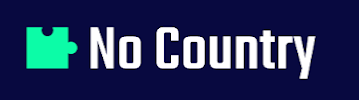

<a name="readme-top"></a>

<div align="center">
  
  <br/>

  <h3><b>Readme</b></h3>

</div>

<!-- TABLE OF CONTENTS -->

# 📗 Table of Contents

- [📖 About the Project](#about-project)
  - [🛠 Built With](#built-with)
    - [Tech Stack](#tech-stack)
    - [Key Features](#key-features)
  - [🚀 Live Demo](#live-demo)
- [💻 Getting Started](#getting-started)
  - [Prerequisites](#prerequisites)
  - [Setup](#setup)
  - [Install](#install)
  - [Usage](#usage)
  - [Run tests](#run-tests)
  - [Deployment](#deployment)
- [👥 Authors](#authors)
- [🔭 Future Features](#future-features)
- [🤝 Contributing](#contributing)
- [⭐️ Show your support](#support)
- [🙏 Acknowledgements](#acknowledgements)
- [❓ FAQ (OPTIONAL)](#faq)
- [📝 License](#license)

<!-- PROJECT DESCRIPTION -->

# 📖 A Dedo <a name="about-project"></a>

> Learn more about our project below.

**A dedo** is a platform were users can share trips and save in cost of fuel or transportation, users can create accounts as drivers or travelers.

## 🛠 Built With <a name="built-with"></a>

### Tech Stack <a name="tech-stack"></a>

> Would you like to know more about the tech and tools we use in this project?

<details>
  <summary>Client</summary>
  <ul>
    <li><a href="https://reactjs.org/">React.js</a></li>
    <li><a href="https://reactrouter.com/en/main">React Router</a></li>
  </ul>
</details>

<details>
  <summary>Server</summary>
  <ul>
    <li><a href="https://expressjs.com/">Express.js</a></li>
  </ul>
</details>

<details>
<summary>Database</summary>
  <ul>
    <li><a href="https://github.com/Automattic/mongoose">ORM: Mongoose</a></li>
  </ul>
</details> 

<!-- Features -->

### Key Features <a name="key-features"></a>

> Describe between 1-3 key features of the application.

- **[key_feature_1]**
- **[key_feature_2]**
- **[key_feature_3]**

<p align="right">(<a href="#readme-top">back to top</a>)</p>

<!-- LIVE DEMO -->

## 🚀 Live Demo <a name="live-demo"></a>

> Try our live demo on the link provided below:

- [Live Demo Link](https://c18-10-t-node-react.onrender.com)

<p align="right">(<a href="#readme-top">back to top</a>)</p>

<!-- GETTING STARTED -->

## 💻 Getting Started <a name="getting-started"></a>

> Describe how a new developer could make use of your project.

To get a local copy up and running, follow these steps.

### Prerequisites

In order to run this project you need:

- a linux terminal or similar
- node.js
- MongoDB installed and running or a MongoDB running in cloud so you can get the
URL that allows the connection.

<!--
Example command:

```sh
 gem install rails
```
 -->

### Setup

In you terminal access the folder where you want to
clone the project:

```sh
  cd my-folder
```

Clone this repository to your desired folder:

```sh
  git clone git@github.com:Diegogagan2587/A-Dedo.git
```


### Install

Install this project with the next steps:
#### Front End

open the `frontend` folder in your terminal an run:

```sh
  npm install
```
#### Back End

Open the `backend` folder in your terminal an run:

```sh
  npm install
```
In your `backend` folder create and .env file and add env variables as shown below:
```JavaScript
// your local port
PORT = 3000
// Add the URL of the DB you want to run in dev/local
URI_CONNECTION_DB_LOCAL = my/database/url/connection

```

### Usage

#### Front End
To run the project, make sure you have opened your terminal in the `frontend` folder and execute the following command:

```sh
  npm run dev
```

#### Back End
To run the Back-End, make sure you have opened your terminal in the `backend` folder and execute the following command:

```sh
  npm run start
```

### Run tests

To run tests, run the following command:

<!--
Example command:

```sh
  bin/rails test test/models/article_test.rb
```
--->

### Deployment

You can deploy this project using:

<!--
Example:

```sh

```
 -->

<p align="right">(<a href="#readme-top">back to top</a>)</p>

<!-- AUTHORS -->

## 👥 Authors <a name="authors"></a>

> Mention all of the collaborators of this project.

👤 **Author1**

- GitHub: [@githubhandle](https://github.com/githubhandle)
- Twitter: [@twitterhandle](https://twitter.com/twitterhandle)
- LinkedIn: [LinkedIn](https://linkedin.com/in/linkedinhandle)

👤 **Author2**

- GitHub: [@githubhandle](https://github.com/githubhandle)
- Twitter: [@twitterhandle](https://twitter.com/twitterhandle)
- LinkedIn: [LinkedIn](https://linkedin.com/in/linkedinhandle)

👤 **Diego Vidal Lopez**

- GitHub: [@Diegogagan2587](https://github.com/Diegogagan2587)
- X (former Twitter): [@dieg02587](https://x.com/dieg02587)
- LinkedIn: [Diego Vidal](https://www.linkedin.com/in/diego-vidal-lopez/)
- Portfolio: [https://dvloper-z.com/](https://dvloper-z.com/)

<p align="right">(<a href="#readme-top">back to top</a>)</p>

<!-- FUTURE FEATURES -->

## 🔭 Future Features <a name="future-features"></a>

> Describe 1 - 3 features you will add to the project.

- [ ] **[new_feature_1]**
- [ ] **[new_feature_2]**
- [ ] **[new_feature_3]**

<p align="right">(<a href="#readme-top">back to top</a>)</p>

<!-- CONTRIBUTING -->

## 🤝 Contributing <a name="contributing"></a>

Contributions, issues, and feature requests are welcome!

Feel free to check the [issues page](https://github.com/No-Country/c18-10-t-node-react/issues).

### Design

We appreciate that contributions stick to the [ "A Dedo" original design](https://www.figma.com/design/YbC0ufOAtOibXYnZdOMqz3/a-dedo?node-id=0-1&t=KKktJ5fEKnxu5gFy-0)

<p align="right">(<a href="#readme-top">back to top</a>)</p>

<!-- SUPPORT -->

## ⭐️ Show your support <a name="support"></a>

> Write a message to encourage readers to support your project

If you like this project...

<p align="right">(<a href="#readme-top">back to top</a>)</p>

<!-- ACKNOWLEDGEMENTS -->

## 🙏 Acknowledgments <a name="acknowledgements"></a>

> Give credit to everyone who inspired your codebase.

I would like to thank...

<p align="right">(<a href="#readme-top">back to top</a>)</p>

<!-- FAQ (optional) -->

## ❓ FAQ (OPTIONAL) <a name="faq"></a>

> Add at least 2 questions new developers would ask when they decide to use your project.

- **[Question_1]**

  - [Answer_1]

- **[Question_2]**

  - [Answer_2]

<p align="right">(<a href="#readme-top">back to top</a>)</p>

<!-- LICENSE -->

## 📝 License <a name="license"></a>

This project is [MIT](./LICENSE) licensed.

<p align="right">(<a href="#readme-top">back to top</a>)</p>
